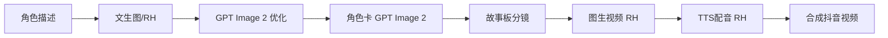

# 🔧 工作流概述

## 全链路生产流程

## 各步骤详细说明

### 1. 文生图（RunningHub）
- 工作流ID：`2046235426792411137`
- 尺寸：576×1024 竖版
- 输出：角色定妆照

### 2. 高清优化（GPT Image 2）
- API：`https://ai.t8star.cn/v1/images/generations`
- 模型：`gpt-image-2`
- 尺寸：576×1024

### 3. 角色卡（GPT Image 2）
- 尺寸：1024×576 (16:9)
- 模板：见 [[角色卡样板提示词]]

### 4. 故事板（GPT Image 2 / RH）
- 模板：见 [[故事板样板提示词]]
- 格式：16:9 黑白手绘多面板

### 5. 图生视频（RH）
- 工作流ID：需指定

### 6. TTS配音（RH）
- 工作流ID：`2044664193500057602`
- 音色：邻家妹子（见 TTS 配文描述设置）

### 7. 视频合成
- 数字人：`digital_human_small.png` (576×1024)
- 输出：MP4 竖屏

## 相关文件
- [[../03-工作流与API/RunningHub API 参考]]
- [[../03-工作流与API/抖音新闻视频全链路文档]]
